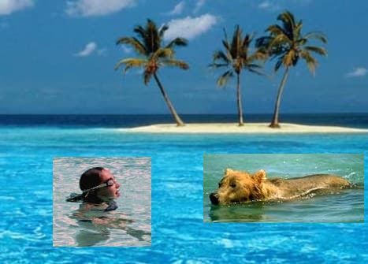

# Poisson Image

王润泽

## 问题提出

实现图像融合


<center>Figure1

​	如图所示，$f$ 是定义域在 $\Omega$处的待融合图像，$f^*$是定义域为 $S$ 的背景图，要解决的问题是让二者能自然的融合。所谓自然融合，就是在保持原图像内部梯度(最小化新图与原图的梯度差异)的前提下，让粘贴后图像的边界值与新的背景图相同，以实现无缝粘贴的效果。

## 图像融合算法

### 数学形式

​	从数学上讲，对于嵌入新背景待求的新图像$f(x,y)$，新背景$f^*(x,y)$和原来的图像 $g(x,y)$ ，等价于解最优化问题：
$$
\begin{equation}
		\min\limits_f \iint _\Omega |\nabla f-\nabla g |^2 \ \ \mathrm{with}\ f|_{\partial \Omega}=f^*|_{\partial \Omega}
	\end{equation}\tag1
$$
​	利用变分法通过 Euler-Lagrange equation 可转化为具有Dirichlet边界条件的Poisson方程：
$$
\begin{equation}
		\Delta f= \Delta  g\ \mathrm{over}\ \Omega \ \ \mathrm{with}\ f|_{\partial \Omega}=f^*|_{\partial \Omega}
	\end{equation}\tag2
$$
​	如果令 $\widetilde f=f-g$，$(f^*-g)=\varphi$那么该问题就可以转换成求解 Laplace 方程的边界问题：
$$
\begin{equation}
		\Delta \widetilde f= 0\ \mathrm{over}\ \Omega \ \ \mathrm{with}\widetilde f|_{\partial \Omega}=(f^*-g)|_{\partial \Omega}=\varphi|_{\partial \Omega}
	\end{equation}\tag3
$$
这里的 $f^*, g, \varphi$都是已知的边界条件，而 $\widetilde f$ 是待求解的函数。

### 数值方程

​	为了进行数值上的求解，则要对 $\Delta f$ 离散化处理，处理方式利用有限差分的形式，设像素点步长为 $h=1$ 对于 $S$区域内任意点 $\bold p=(i,j)$来说，该点对应 $f$ 值记作 $f_p$，那么有
$$
\Delta f_p\approx\frac{4f(i,j)-f(i+1,j)-f(i-1,j)-f(i,j+1)-f(i,j-1)}{4h^2}\tag4
$$
​	为了表达式的简单，定义$N_p$为$S$中的每一个像素$p$四个方向连接邻域，令$\left<p,q\right>$为满足$q\in N_p$的像素对，即 $q\in\{(i+1,j),(i-1,j),(i,j+1),(i,j-1)\}$，则可以得到数值方程解法
$$
\begin{equation}
		\mathrm{for}\ \mathrm{all}\ p\in \Omega,\ |N_p|\widetilde f_p-\sum\limits_{q\in N_p\cap \Omega} \widetilde f_q=\sum\limits_{q\in N_p\cap \partial \Omega}\varphi_p
	\end{equation}\tag5
$$

### 矩阵方程

设 $\widetilde f_{ij}=u_{ij},\varphi_p=\varphi_{ij}$
$$
4u_{i,j}-u_{i,j-1}-u_{i-1,j}-u_{i+1,j}-u_{i,j+1}=0\quad(i,j)\in \Omega\backslash\part\Omega\tag6
$$

$$
u_{k,l}=\varphi(k,l)\quad (k,l)\in\part\Omega\tag7
$$


如果以矩形区域举例，$\Omega=\{(i,j)|0\le i\le m,0\le j\le m\}$

则对于上式一共有 $(m+1)\times (n+1)$个未知数 $u_{ij}$ ，公式（5）与公式（6）一共有 $(m+1)\times (n+1)$个约束条件，且这些条件线性无关，故是可解的。

对于更加一般的边界，算法描述如下

0. 初始化，设 $\Omega\backslash\part\Omega$内的像素点共有 $N$ 个，建立 $N\times N$ 系数矩阵`coe_sparse_mat=0`,以及代求N维待求向量 `vec` 。同时假设区域 $S$ 内公有 $n\times m$各像素点，从起始点出发。
1. 遍历区域 S 内的像素点（i,j）
2. 如果 $(i,j)\in\Omega\backslash\part\Omega$，设`index(i,j)=i * n+j`
   - `coe_sparse_mat[index(i,j)][index(i,j)]= 4`
   - 如果 $(i,j)$周围的点 $\bold q\in \Omega\backslash\part\Omega$,那么 `coe_sparse_mat(q)=-1`
   - 如果 $(i,j)$周围的点 $\bold q\in \part\Omega$,那么 `vec[index(q)]=`$\varphi$`[index(q)]`
3. 求解方程 `coe_sparse_mat` * `x`=`vec`, where `x(index(i,j)) = u(i,j)`.

最终解得 $\widetilde f_{ij}=u_{ij}$，得到最终图像的像素值为：
$$
f(i,j)=\widetilde f(i,j)+g(i,j)
$$
其中 $g(i,j)$ 为原来的图像的像素值，$\widetilde f(i,j)$ 为刚求解得到的值。

## 多边形扫描算法

​	为了更好的确定边界 $\part \Omega$ 与 待求区域 $\Omega$，需通过扫描线算法获取多边形内部掩膜。

​	**有序边表法**：其基本思想是定义边表ET和活动边表AET特殊的数据结构，避免了求交运算。

### 活跃边表（Active Edge Table，AET）

​	用这个表存贮与当前扫描线相交的各边。每次离开一条扫描线进入下一条之前，将表中有但与下一条扫描线不相交的边清除出表，将与下一条扫描线相交而表中没有的边加入表中。**AET中总是按x坐标递增排序**，因为在进行填充时，需要按该顺序判断是进入多边形内部还是从多边形内部出去。	

- ymax:该边所交的最高扫描线的坐标值
- x:当前扫描线与边的交点坐标
- Δx:从当前扫描线到下一条扫描线间x的增量
- next:指向下一条边的指针

### 边表（Edge Table，ET）

（1）在对多边形进行填充之前，首先应该建立多边形的边表来存储多边形的边的信息，边表是一种邻接表。**ET中各登记项按y坐标递增排序**，每一登记项下的“吊桶”按所记x坐标递增排序，“吊桶”中各项的内容依次是：

- 边的另—端点的较大的y坐标ymax。

- 与较小的y坐标对应的边的端点的x坐标xmin。

- 斜率的倒数，即1/m。
- 指向下一条边的指针next

[](https://ezeli.github.io/2019/08/26/四、多边形的扫描转换算法原理和实践/07c84625d6deb13b907d286e2f24249f.png)

（2）注意：在建立边表时，当顶点表现为是局部极大或局部极小时（下图中的B点），就看做是二个点，否则看做一个点。实际处理这个问题时，对局部极大或局部极小的顶点无需处理，而其它的顶点应该沿着边的方向缩进一个单位。

理由如下：例如在下图中，对于B点来来说，无需多做处理，因为当扫描线 y=9 时，e2和e3都会包含到AET中，也就是说B点在当前AET中会出现两次，当进行填充时，在该点会完成一次进入和退出，也就不会出现错误填充的情况。而对于A点来说，如果不进行缩进，当扫描线 y=3 时，e1和e2都会包含到AET中，所以A点同样在当前AET中出现两次，此时，AET中有三个点，y=3 这一行上A点之后的多边形内部区域并不会进行填充，发生错误，而且AET中应该永远包含偶数个点才对；进行缩进后，A点在当前AET中只出现一次，并且此时AET中有偶数个点，填充正确。

[](https://ezeli.github.io/2019/08/26/四、多边形的扫描转换算法原理和实践/149ccb7462202b29b4f5c5b3f6ac4e2d.png)

（3）建立好的ET如下所示：

[](https://ezeli.github.io/2019/08/26/四、多边形的扫描转换算法原理和实践/bc00a617a66bb00e10eb530edbca410f.png)

这里e2，e5进行了缩进，而e1,e3,e4没有

### 扫描过程


### 填充算法

```c
void Polygonfill(EdgeTable ET,  COLORREF color)
{
    1.y=边表ET中各登记项对应的y坐标中最小的值;
    2.活跃边表AET初始化为空表;
    3. while(ET表中仍有扫描线未被处理) //处理ET表中的每一条扫描线
    {
        3.1将ET中登记项y对应的各“吊桶”合并到表AET中，
        将AET中各吊桶按x坐标递增排序；
        3.2在扫描线y上,按照AET表提供的x坐标对，用color实施填充；
        3.3将AET表中有y=ymax的各项清除出表；
        3.4对AET中留下的各项,分别将x换为x+1/m.
        3.5由于前一步可能破坏了AET表中各项x坐标的递增次序，
        故按x坐标重新排序；//非简单多边形 
        3.6 y++，去处理下一条扫描线。
    }
}
```

## 结果展示

在游泳池里有一个女孩在开心的游泳，而一只熊在另一条河里游泳，他们所在的水域不同，如下图所示


现在我们将这两个倒霉的家伙放到海洋里，如果只是简单拷贝与复制的话，则有一下结果



然而，借助我们的Poisson 融合图像算法，可以使他们更加自然的融入大海


正如你所见，使用我们的算法后图像更加自然的与周围的环境匹配，不过还有可以改善的空间！
